<div id="top"></div>


<!-- PROJECT LOGO -->
<br />
<div align="center">
    
  <h2 align="center">HSLA Image color space</h2>
  <h3 align="center">Applying inheritance knowledge to manipulate HSLa images</h3>
</div>


<!-- TABLE OF CONTENTS -->
<details>
  <summary>Table of Contents</summary>
  <ol>
    <li>
      <a href="#about-the-project">About The Project</a>
      <ul>
        <li><a href="#getting-started">getting-started</a></li>
        <li><a href="#Understanding-the-HSL-Color-Space">UsaUnderstanding the HSL Color Spacege</a></li>
        <li><a href="#The-PNG-class">The PNG class</a></li>
      </ul>
    </li>
    <li><a href="#Inhertance-diagram">Inhertance diagram</a></li>
      <ul>
        <li><a href="#Image">Image</a></li>
            <ul> 
              <li><a href="#lighten">lighten</a></li>
              <li><a href="#saturate">saturate</a></li>
              <li><a href="#rotateColor">rotateColor</a></li>
            </ul>
        <li><a href="#Grayscale">Grayscale</a></li>
        <li><a href="#Illini">Illini</a></li>
        <li><a href="#Spotlight">Spotlight</a></li>
      </ul>
  </ol>
</details>


<!-- ABOUT THE PROJECT -->
## About The Project

<!-- GETTING STARTED -->
### Getting Started

This is an example of how you may give instructions on setting up your project locally.
To get a local copy up and running follow these simple example steps.

1. [**How to install Qt**](https://anassbelcaid.github.io/CS221/qtcreator/)
2. **Clone the repo**
   ```sh
   git clone https://github.com/IlyasKadi/HSLA-Image-color-space.git
   ```

<p align="right">(<a href="#top">back to top</a>)</p>

<!-- Understanding the HSL Color Space -->
### Understanding-the-HSL-Color-Space

**The HSL color** system uses the `Hue`, `Saturation` and `Luminance` of the color. From the Adobe Techinag Guide page an brief explanation of each attribute is given as follow:

   **Hue** ( denoted `h`) define the color itself, for example red in distinction to blue or yellow. The values of the hue axis run from $[0-360]$ beginning and ending with red and running through green, blue and all intermediary colors like greenish-blue, orange, purple, etc.
   
   <p align="center">
     
   </p>  
   
   >The Hue representation of basic colors. 
        
   **Saturation** (denoted as `s`) indicates the degree to which the hue differs from a neutral gray. The values run from $0\%$, which is no color saturation, to $100\%$, which is the fullest saturation of a given hue at a given percentage of illumination.
   
   <p align="center">
     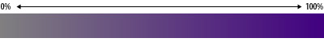
   </p>  
   
   >The saturation field in the HSL space.
   
   **Luminance** (denoted as `l`) indicates the level of illumination.
   The value values run as pecentenage $0\%$ appears black (no light) while $100/%$ is full illumination.
   
   <p align="center">
     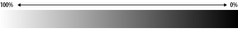
   </p>  
  
   >The saturation field in the HSL space.

   **The full HSL color space** is a three-dimensional space, but it is not a cube. The area truncates toward the two ends of the luminance axis and is widest in the   middle rangel. The ellipsoid reveals several properties of the HSL colro space:
   
   <p align="center">
     
   </p>
   
   >Representation of the HSL color space. 

<p align="right">(<a href="#top">back to top</a>)</p>

<!-- The PNG class -->
### The-PNG-class

the [project](https://github.com/IlyasKadi/HSLA-Image-color-space) contain a class called `PNG` that implement basic images maniplation like:

   * **Reading** an image from the system.
    
   * **Writing** an image into the system.
    
   * **Accessing** pixels of this image.

Here is a glance for this class header:

```cpp
class PNG{
    PNG();   //default constructor
    PNG(int, int): //constructor with width and height
    ~PNG();         //Destructor
    bool readFromFile(string);  //read from a file
    bool writeToFile(string);  //write content to a file
    HSLAPixel  getPixel(int x, int y); //get content for pixel x, y
};
```

<p align="right">(<a href="#top">back to top</a>)</p>


<!-- Inhertance diagram -->
## Inhertance-diagram

Your goal is to write additional classes that inherit from this class and implement addtional functionalities.

<p align="center">
  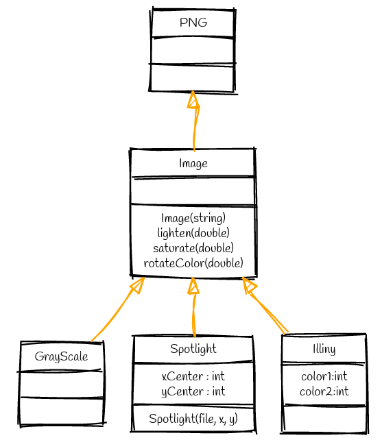
</p>

 >UML class diagram for the additional Images classes.

<p align="right">(<a href="#top">back to top</a>)</p>


<!-- Image -->
## Image
Create a class named `Image` that inherits from the `PNG` class. This means that your class will inherits all the attributes and members from the `PNG` class. Meaning that anything you can do with a `PNG` you can do with an `Image`.
  

.Header
```cpp
class Image : public PNG
{
public:
    using PNG::PNG;
    Image(string filename);
    void lighten(double amount=0.1);
    void saturate(double amount);
    void rotateColor(double angle);
};
```
<p align="right">(<a href="#top">back to top</a>)</p>

### lighten

* `lighten(double amount)` changes the luminance of each pixel by amount.

original | lighten
------------ | -------------
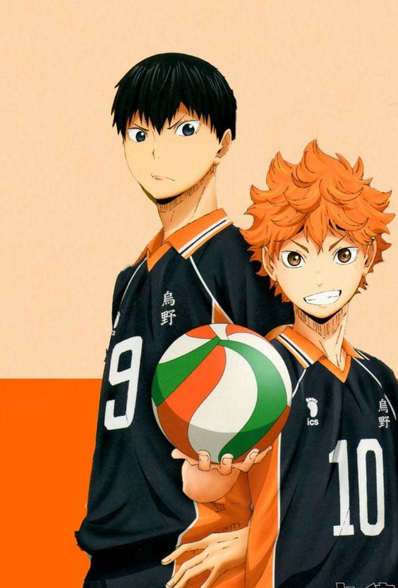 | 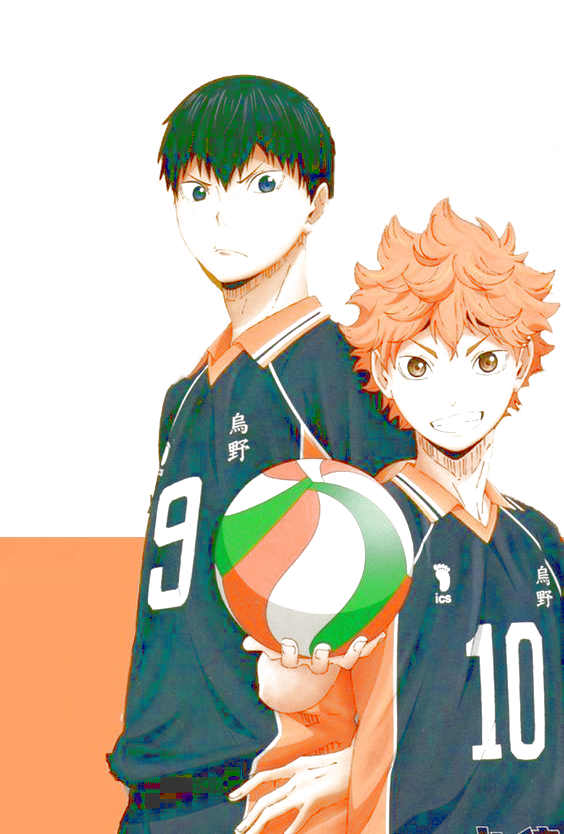

>Effect of adding 0.2 light on the image. 

.cpp
```cpp
void Image::lighten(double amount)
{
    for(unsigned i=0;i< width();i++)
    {
        for(unsigned j=0;j<height();j++)
        {
            HSLAPixel &p  = getPixel(i,j);
            p.l += amount;
            p.l = (p.l>0) ? p.l:0;
            p.l = (p.l<=1)? p.l:1;
        }
    }
}
```

<p align="right">(<a href="#top">back to top</a>)</p>

### saturate

* `saturate` changes the **luminance** by amount. 

original | saturate
------------ | -------------
 | 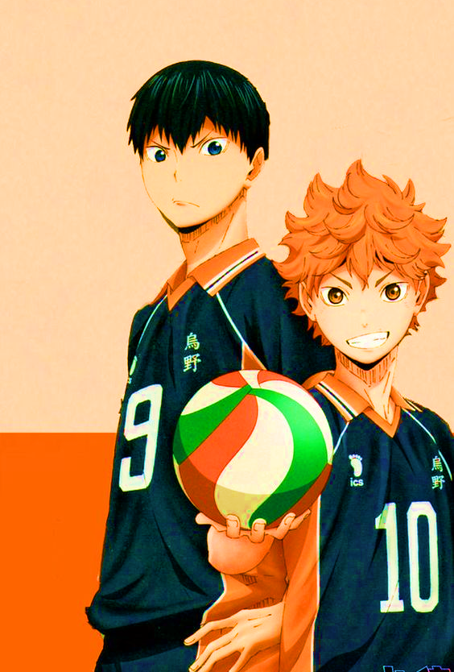

>Effect of adding 0.2 light on the image. 

.cpp
```cpp
void Image::saturate(double amount)
{
    for(unsigned i=0;i< width();i++)
    {
        for(unsigned j=0;j<height();j++)
        {
            HSLAPixel &p  = getPixel(i,j);
            p.s += amount;
            p.s = (p.s>0) ? p.s:0;
            p.s = (p.s<=1)? p.s:1;
        }
    }
}
```

<p align="right">(<a href="#top">back to top</a>)</p>

### rotateColor

* `rotateColor(double angle)`: add the value of angle to each pixel.

original | rotateColor
------------ | -------------
 | 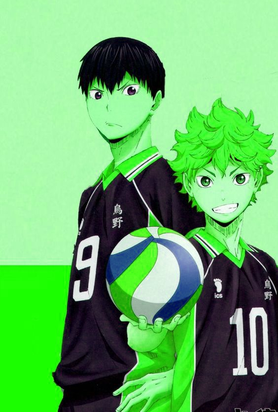

>Effect of rotating the image by 90 degrees. 

.cpp
```cpp
void Image::rotateColor(double angle)
{
    for(unsigned i=0;i< width();i++)
    {
        for(unsigned j=0;j<height();j++)
        {
            HSLAPixel &p  = getPixel(i,j);
            p.h += angle;
            while (p.h>360)
                p.h=p.h-360;
            while (p.h<0)
                p.h=p.h+360;
        }
    }
}
```


<p align="right">(<a href="#top">back to top</a>)</p>


<!-- Grayscale -->
## Grayscale

Now you should write a simple class `Grayscale` that inherits from the `Image` class. This is a simple class that eliminates all the colors and represents the image using only a `grayscale` level.

original | Grayscale
------------ | -------------
 | 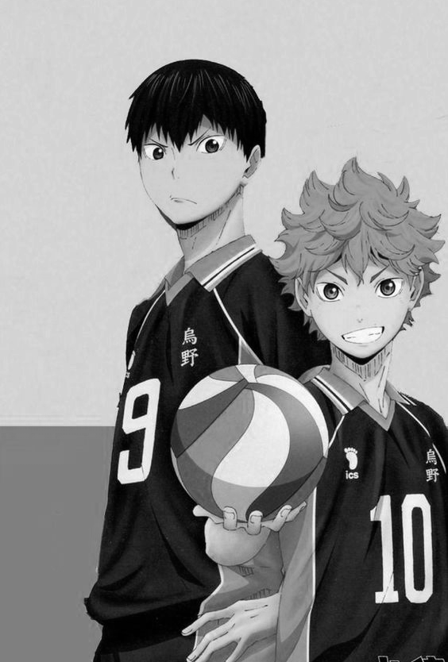

>Effect of reducing the saturation of each pixel. 

.Header 
```cpp
class Grayscale : public Image
{
public:
     using Image::Image;
     using PNG::writeToFile;
     Grayscale(string filename);
};
``` 
.cpp
```cpp
Grayscale::Grayscale(string filename):Image(filename)
{
    readFromFile(filename);
    saturate(-1);
}
```

<p align="right">(<a href="#top">back to top</a>)</p>


<!-- Illini -->
## Illini

Create a class called `Illini` that inherits from the `Image` class. An `Illini` image has only two colors that are defined as attributes.

We divided the hue cercle into the closest arc to the first color (in this case orange h=11), and the one close to the second color (in this case blue h=216)

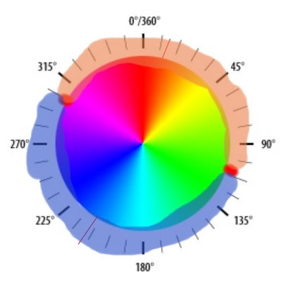

original | Illini
------------ | -------------
 | 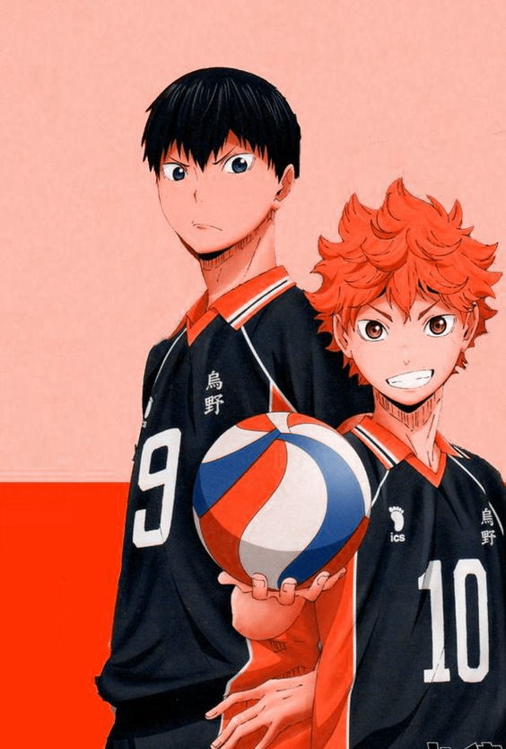

>Illini Image which only stores two color (in this case blue and orange).

.Header
```cpp
class Illini : public Image
{
public:
    using Image ::Image;
    int color1 =11;
    int color2 =216;
    Illini(string filename,int color1=11,int color2=216);
};
```

.cpp
```cpp
Illini::Illini(string filename,int col1,int col2):Image(filename)
{
    this->color1=col1;
    this->color2=col2;
    readFromFile(filename);
    for(unsigned x = 0; x < width() ; x++)
      for(unsigned y = 0; y < height(); y++)
      {
         //reference on the pixel
         HSLAPixel &P = getPixel(x, y);
         //modifiy the element of P
         int ma_hue=max(color1,color2);
         int mi_hue=min(color1,color2);
         int half_r_dist=(ma_hue-mi_hue)/2;
         int half_l_dist=(360-ma_hue+mi_hue)/2+ma_hue;
        P.h= (P.h>half_r_dist && P.h<=half_l_dist) ?ma_hue:mi_hue;
      }
}
```
<p align="right">(<a href="#top">back to top</a>)</p>

## Spotlight

A `Spotlight` image create a **spotlight** centered at a given point `centerX, centerY` defined as attributes.

original | Spotlight
------------ | -------------
 | 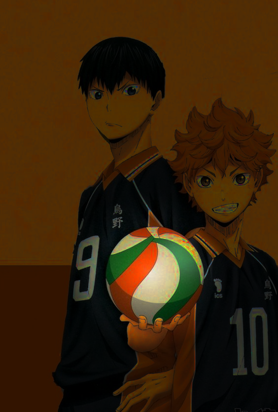
>Illustration of the spotlight effect. 

.Header
```cpp
class Spotlight : public Image
{
public:
    using Image::Image;
    int centerX;
    int centerY;
    Spotlight(string filename, int centX, int centY);
    void changeSpotPoint(int cX, int cY);
};
```

.cpp
```cpp
Spotlight::Spotlight(string filename,int centX, int centY):Image(filename)
{
    this->centerX=centX;
    this->centerY=centY;
    readFromFile(filename);
    for(unsigned x = 0; x < width() ; x++)
      for(unsigned y = 0; y < height(); y++)
      {
         double dist = sqrt(((x-centerX)*(x-centerX))+((y-centerY)*(y-centerY)));
         //reference on the pixel
         HSLAPixel &P = getPixel(x, y);
         //modifiy the element of P
         if(dist<160)
              P.l=P.l*(1-dist*0.005);
         else
            P.l=0.2*P.l;
      }
}
```
## ChangeSpotPoint

Spotlight | ChangeSpotPoint
------------ | -------------
 | 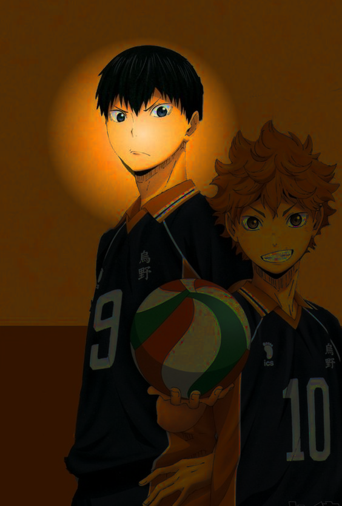

After completing the all the tests, add a method

```cpp
void changeSpotPoint(int centerX, int centerY)
```

That changes the position of the spotlight.
```cpp
void Spotlight::changeSpotPoint(int cX, int cY)
{
    for(unsigned x = 0; x < width() ; x++)
      for(unsigned y = 0; y < height(); y++)
      {
         double O_dist = sqrt(((x-centerX)*(x-centerX))+((y-centerY)*(y-centerY)));
         double N_dist = sqrt(((x-cX)*(x-cX))+((y-cY)*(y-cY)));
         //reference on the pixel
         HSLAPixel &P = getPixel(x, y);
         //modifiy the element of P
         if(O_dist>=160)
             P.l=5*P.l;
         else
            P.l=P.l/(1-O_dist*0.005);

         if(N_dist>=160)
             P.l=0.2*P.l;
         else
            P.l=P.l*(1-N_dist*0.005);
      }
}
```

Out Team - [AIT EL KADI Ilyas](https://github.com/IlyasKadi) - [AZIZ Oussama](https://github.com/ATAMAN0)

Project Link: [https://github.com/IlyasKadi/HSLA-Image-color-space](https://github.com/IlyasKadi/HSLA-Image-color-space)

<p align="right">(<a href="#top">back to top</a>)</p>


